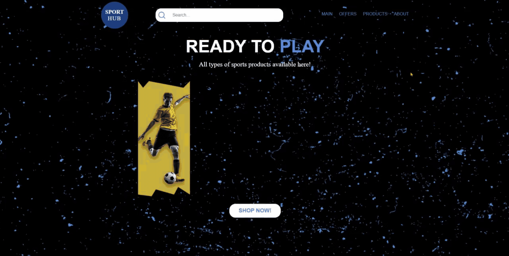

# CΛVΛLIΞRE #

# SPORT HUB #
Bem-vindo ao Sport Hub, o site de e-commerce dedicado aos entusiastas de esportes! Aqui você encontra uma ampla variedade de produtos esportivos, desde acessórios até equipamentos, com uma interface moderna e responsiva.

## 🚀 Tecnologias Utilizadas
React.js ⚛️

- Vite ⚡
- CSS3 com responsividade 📱
- Font Awesome
- Google Fonts (Racing Sans One, Josefin Sans)

## 🎯 Funcionalidades

🛒 Catálogo de produtos com imagens interativas

🔍 Barra de busca para facilitar a navegação

📱 Design totalmente responsivo

🌟 Navegação intuitiva com links para seções principais

🛍️ Botão "Shop Now!" chamativo para ação

📦 Layout limpo e otimizado para a melhor experiência de compra

🎮 Visibilidade de produtos com destaque visual

Link do projeto: <a href="https://shop-sport-rho.vercel.app/" target="_blank" rel="noopener noreferrer">
  Acessar Projeto
</a>

## 📸 GIF do Projeto:

